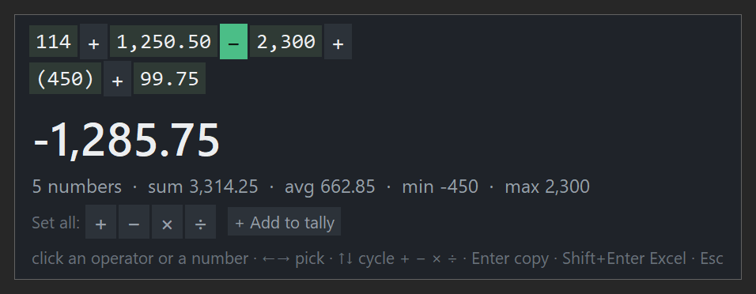

# SumSelect

Highlight numbers anywhere in Windows, press a hotkey, and build the calculation you want —
not just a total.

<p align="center"></p>

Most "sum selected numbers" tools apply one operation to everything. SumSelect turns each
number into a tag with a **clickable operator between each pair**, so you can mix `+ − × ÷`
in a single go and watch the result change as you do.

## What it does

Press **`Ctrl+Alt+S`** and your selection becomes a formula you can edit:

- **Change any operator** — click it to cycle `+ − × ÷`, or use the keyboard. The result
  updates live and follows normal order of operations (`×` and `÷` before `+` and `−`), so it
  agrees with Excel.
- **Drop a number** — click a tag to leave out something that isn't part of the sum: a year, a
  line number, a percentage.
- **Set all** — one click applies the same operator everywhere, for a plain total.
- **Two windows, one formula** — **Pin** the popup and it stops timing out and stops
  taking focus. Select in another window, press the hotkey again, and those numbers join
  the same formula with their own operator at the seam. Each source gets a colour and a
  name you can click to remove.
- **Tally** — collect results from different windows into one running total, kept across restarts.
- **Rounding** — full precision, 2 decimals or 0 decimals, rounded half-up.
- **History** — the last 10 results sit in the tray menu; click one to copy it.
- **Excel export** — `Shift+Enter` copies the working as a formula, e.g.
  `=1250.5+2300*-450+99.75`, ready to paste into a sheet.
- **Auto-on-copy** (optional) — any `Ctrl+C` containing two or more numbers shows the result
  without taking focus from whatever you're typing in.

It reads numbers the way they actually appear in documents: thousands separators (`1,250.50`),
brackets as negatives (`(450)` → −450), leading signs, and non-ASCII digit forms. It works in
browsers, PDF readers, Word, Notepad, spreadsheets, terminals — anywhere text can be selected.

## Controls

| | Mouse | Keyboard |
| --- | --- | --- |
| Change an operator | click it | `←` `→` to pick, `↑` `↓` to cycle, or type `+` `-` `*` `/` |
| Drop or restore a number | click the tag | — |
| Copy the result | click the result | `Enter` |
| Copy as an Excel formula | — | `Shift+Enter` |
| Add to tally | "+ Add to tally" | `T` |
| Pin for a second window | "Pin" | `P` |
| Close | — | `Esc` |

## Install

Download the zip from [Releases](../../releases), unblock it (right-click → Properties →
Unblock if Windows marks it), extract anywhere, and run `SumSelect.exe`. It lives in the system
tray; turn on **Start with Windows** from its menu.

To build from source instead — Windows, Python 3.12+:

```powershell
git clone https://github.com/MAK340/sumselect.git
cd sumselect
python -m venv .venv
.\.venv\Scripts\python.exe -m pip install comtypes pystray pillow pyinstaller
powershell -ExecutionPolicy Bypass -File .\build.ps1
```

`build.ps1` pre-generates the UI Automation COM wrapper, runs the self-test, builds a one-folder
PyInstaller bundle, installs it to `%LOCALAPPDATA%\SumSelect\app`, registers it to start with
Windows and launches it.

Run from source without building: `.\.venv\Scripts\pythonw.exe sumselect.py`

## Footprint

Measured on a 16-core laptop:

| | |
| --- | --- |
| RAM | ~16 MB resident (28 MB private) |
| CPU, idle | 0.02% — about 3 ms per second |
| CPU, per calculation | ~140 ms |
| Cold start | ~1 s |

It stays out of the way by design:

- **Win32 `RegisterHotKey`** rather than a global keyboard hook, so it costs nothing while you type.
- **UI Automation** reads the selection directly — no clipboard round-trip. It falls back to a
  synthetic `Ctrl+C` only when an app won't hand over its selection, then puts your clipboard
  back as it was.
- **`AddClipboardFormatListener`** for auto-on-copy: event driven, never polling.
- One popup window, reused rather than recreated, and the internal timer slows down when idle.

## Settings

`%APPDATA%\SumSelect\config.json`. Edit it, then choose **Reload settings** in the tray menu.
The file is read with or without a byte-order mark, so editing it in Notepad is safe.

```json
{ "hotkey": "ctrl+alt+s", "auto_copy": false, "popup_seconds": 6, "decimals": null }
```

`decimals` is `null`, `0` or `2`. Hotkey syntax is modifiers (`ctrl` `alt` `shift` `win`) plus a
letter, digit, `f1`–`f24` or a named key. If the combination is already taken by another
program, the tray icon tells you.

## Tests

```powershell
.\.venv\Scripts\python.exe sumselect.py --test
```

Covers the number parser, operator seeding, the precedence evaluator and the formatters against
awkward input: bracketed negatives, alternative digit forms, dates, thousands separators,
division by zero.

## Notes

**Dates.** `2026-09-19` is read as three numbers joined by `+`, not as a subtraction — a hyphen
between digits only counts as an operator when the whole selection reads as a calculation.

**Brackets.** The builder applies `×` and `÷` before `+` and `−` but has no grouping of its own.
When brackets in the original text change the answer, the popup shows that result too, labelled
*as written*.

**The icon** was generated locally with ComfyUI (Qwen-Image) for the tile, with the Σ composited
on top in code — image models draw letters unreliably and the glyph has to stay crisp at 16 px.
`comfy_icon.py` and `compose_icon.py` reproduce it.

## Files

| | |
| --- | --- |
| `sumselect.py` | the whole app — parser, evaluator, Win32 plumbing, Tk popup, tray |
| `build.ps1` | build and install |
| `comfy_icon.py`, `compose_icon.py` | icon generation |
| `icon.png`, `icon.ico` | the generated icon |

## Licence

MIT
